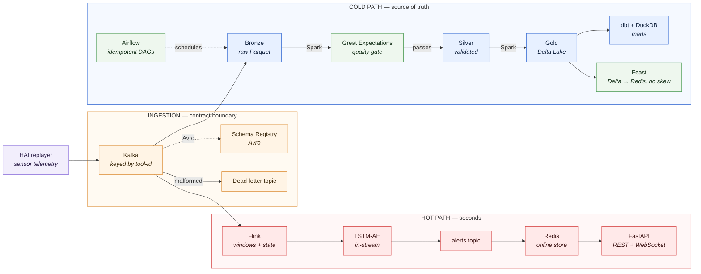
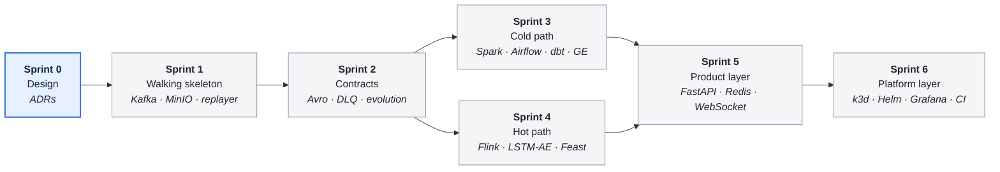

# Real-Time Event Stream & Anomaly Platform

`Kafka` · `Flink` · `Spark` · `Delta Lake` · `MinIO` · `Airflow` · `dbt` · `DuckDB` · `Redis` · `FastAPI` · `PyTorch` · `k3d + Helm` · `Grafana`

**Status:** Sprint 0 — design · Runs on one laptop · No managed cloud required

A production-grade streaming lakehouse on a single machine: hot path for real-time anomaly detection, cold path as the governed source of truth, and a serving layer with clear SLOs. Every claim in this README is measured and reproducible from a clean clone.

## Goal

Demonstrate end-to-end data platform engineering — ingestion contracts, stream processing, lakehouse modeling, orchestration, feature serving, and observability — with honest, measured numbers instead of marketing claims. Target figures (throughput, p95 end-to-end latency, consumer lag under burst) are filled in below as each sprint completes.

## The Scenario

A fleet of industrial equipment emits high-frequency sensor telemetry (replayed from the public **HAI** security testbed dataset). The system must:

1. **Detect excursions in real time** — bursts of anomalous readings from any tool, scored by a pre-trained LSTM-Autoencoder model, with alerts pushed within seconds.
2. **Maintain a governed lakehouse** — raw telemetry as the immutable source of truth, curated layers for backfill, retraining, and daily utilization reporting.

> **Domain mapping.** The architecture is domain-neutral. The same shape serves a consumer live-events platform one-to-one: chat/gift event spikes ≡ excursion bursts; per-message toxicity scoring ≡ per-reading anomaly scoring; "viral moment" push ≡ excursion alert push. Only the producer and the model change; the platform does not.

## Architecture



<sub>Prometheus scrapes every box above; Grafana renders the numbers in [Measured results](#measured-results).</sub>

**Design rule:** the hot path stays minimal and cheap — it is a cache of urgency. The cold path is the source of truth. Lambda-style separation costs some duplication but buys independent failure domains.

## Tech Stack — and why each component exists

Every row answers a question. If a technology does not answer one, it is not in the stack.

<table>
<tr><td colspan="2"><b>① Ingestion &amp; contracts</b> — <i>the boundary where bad data is stopped</i></td></tr>
<tr>
  <td width="30%"><b>Apache Kafka</b><br/><sub>partitioned by tool-id</sub></td>
  <td>How do we absorb bursts, decouple producers, and replay history?</td>
</tr>
<tr>
  <td><b>Schema Registry (Avro)</b><br/><sub>+ dead-letter topic</sub></td>
  <td>How do schema changes fail loudly at the boundary instead of corrupting downstream?</td>
</tr>
<tr><td colspan="2"><b>② Hot path</b> — <i>seconds, a cache of urgency</i></td></tr>
<tr>
  <td><b>Apache Flink</b><br/><sub>event-time windows, keyed state, timers, side outputs</sub></td>
  <td>How do we compute per-tool windowed features and rate-limit alert storms with second-level latency?</td>
</tr>
<tr>
  <td><b>LSTM-AE</b><br/><sub>pre-trained, local PyTorch</sub></td>
  <td>How do we score anomalies in-stream without a paid API call per event?</td>
</tr>
<tr><td colspan="2"><b>③ Cold path</b> — <i>the governed source of truth</i></td></tr>
<tr>
  <td><b>Apache Spark</b><br/><sub>Bronze → Silver → Gold</sub></td>
  <td>How do we backfill, reprocess, and retrain from immutable raw data?</td>
</tr>
<tr>
  <td><b>MinIO + Delta Lake</b><br/><sub>Parquet, ACID, time travel</sub></td>
  <td>How do we get warehouse guarantees on object storage?</td>
</tr>
<tr>
  <td><b>dbt + DuckDB</b><br/><sub>on Gold marts</sub></td>
  <td>How are business-facing tables modeled, tested, and documented as code?</td>
</tr>
<tr>
  <td><b>Apache Airflow</b><br/><sub>idempotent DAGs, backfill</sub></td>
  <td>How do batch jobs run idempotently, on schedule, with retries?</td>
</tr>
<tr>
  <td><b>Great Expectations</b><br/><sub>gates Silver promotion</sub></td>
  <td>How does bad data get blocked before it reaches a business-facing table?</td>
</tr>
<tr><td colspan="2"><b>④ Serving, platform &amp; delivery</b> — <i>how anyone else consumes it</i></td></tr>
<tr>
  <td><b>Feast</b><br/><sub>offline: Delta / online: Redis</sub></td>
  <td>How do training and serving read the same features without skew?</td>
</tr>
<tr>
  <td><b>FastAPI + Redis</b><br/><sub>REST, cache, WebSocket push</sub></td>
  <td>How do other services consume scores with a clear SLA?</td>
</tr>
<tr>
  <td><b>Prometheus + Grafana</b></td>
  <td>What are the throughput, p95 latency, consumer lag, and quality pass rate — right now?</td>
</tr>
<tr>
  <td><b>Docker Compose → k3d + Helm</b><br/><sub>HPA on the API</sub></td>
  <td>How does the system deploy, scale, and survive pod restarts?</td>
</tr>
<tr>
  <td><b>GitHub Actions</b><br/><sub>pytest, lint, compose smoke test</sub></td>
  <td>How is every push verified from a clean environment?</td>
</tr>
<tr>
  <td><b>Terraform → GKE</b><br/><sub>stretch: one-shot deploy, then torn down</sub></td>
  <td>How does the local stack map onto managed cloud?</td>
</tr>
</table>

## Explicit non-goals

- **No unmeasured scale claims.** This runs on one machine; the README reports sustained measured throughput, not hypothetical "millions of events per second."
- **No managed-cloud dependency.** The stack is fully open source and free to run. See [Cloud mapping](#cloud-mapping) for the GCP translation.
- **No LLM/RAG components.** Out of scope for a data platform; kept in a separate project.
- **No both-of-everything.** One stream processor (Flink), one batch engine (Spark), one orchestrator (Airflow). Redundant alternatives (Beam, Kafka Streams, metadata catalogs, search engines) are deliberately excluded.

## Measured results

Filled in as sprints complete — every value below is reproduced by `make verify` on a clean clone, not quoted from a blog post.

|     | Metric                                   | Target                                                 | Measured  |
| :-: | ---------------------------------------- | ------------------------------------------------------ | --------- |
| ⏳  | Sustained ingest throughput              | ≥ 5,000 msg/s                                          | *pending* |
| ⏳  | p95 end-to-end latency (produce → alert) | ≤ 5 s                                                  | *pending* |
| ⏳  | Consumer lag recovery after 10× burst    | ≤ 2 min                                                | *pending* |
| ⏳  | Bad-record handling                      | 100% routed to DLQ, 0 pipeline crashes                 | *pending* |
| ⏳  | Data quality gate (Silver)               | 100% suites passing in CI                              | *pending* |
| ⏳  | Resource footprint                       | CPU-core-seconds and RAM per 1M events (Grafana panel) | *pending* |

<sub>⏳ not yet measured · ✅ measured and reproducible · ⚠️ measured, target missed</sub>

## Roadmap

Each sprint ends with something runnable from a clean clone — no sprint depends on a later one.



### 🟦 Sprint 0 — Design · `in progress`

> **Exit criteria:** every irreversible choice has a written ADR.

- [ ] **0.1** ADR: Flink vs Spark Structured Streaming for the hot path
- [ ] **0.2** ADR: Delta vs Iceberg for the lakehouse format
- [ ] **0.3** ADR: exactly-once strategy — transactional producer + idempotent sink, and how it gets verified

### ⬜ Sprint 1 — Walking skeleton · `connectivity`

> **Exit criteria:** `git clone && make up && make verify` works on a clean machine.

- [ ] **1.1** `docker compose up`: Kafka, MinIO, and the replayer producer streaming HAI telemetry
- [ ] **1.2** Raw sink: Kafka → Bronze Parquet on MinIO, partitioned by day/tool
- [ ] **1.3** Verify integrity: row counts and checksums via DuckDB over Bronze
- [ ] **1.4** Makefile targets (`make up`, `make verify`) — clean-clone reproducibility from day one

### ⬜ Sprint 2 — Contracts first · `governance`

> **Exit criteria:** a malformed record cannot crash the pipeline or reach Bronze unnoticed.

- [ ] **2.1** Avro schemas in Schema Registry; producer enforces contracts
- [ ] **2.2** Dead-letter topic + poison-pill test: malformed records route to DLQ with an alert, pipeline never crashes
- [ ] **2.3** Schema evolution demo: additive change flows; breaking change is rejected at the boundary

*Contracts come before intelligence: schema chaos is an ingestion-time problem, and every later sprint builds on trusted inputs.*

### ⬜ Sprint 3 — Cold path · `lakehouse & orchestration`

> **Exit criteria:** a 7-day backfill reruns end to end and produces byte-identical Gold.

- [ ] **3.1** Spark jobs: Bronze → Silver (validated, deduplicated) → Gold (Delta Lake)
- [ ] **3.2** Airflow DAG: idempotent daily runs, catchup/backfill demonstrated on 7 days of history
- [ ] **3.3** Great Expectations suites gate Silver promotion; failures block and alert
- [ ] **3.4** dbt + DuckDB models on Gold: daily tool-utilization mart with schema tests and generated docs

### ⬜ Sprint 4 — Hot path · `streaming intelligence`

> **Exit criteria:** an injected excursion reaches the alerts topic within the p95 latency target.

- [ ] **4.1** Flink job: event-time tumbling windows per tool-id, watermarking, keyed state
- [ ] **4.2** In-stream scoring with the pre-trained LSTM-AE; anomalies routed via side outputs to an alerts topic
- [ ] **4.3** Stateful alert rate-limiting (keyed timers) to suppress alert storms from a single tool
- [ ] **4.4** Feast: offline features from Delta, online features in Redis; training/serving parity test

### ⬜ Sprint 5 — Product layer · `API & caching`

> **Exit criteria:** an external consumer can subscribe to alerts without reading any internal topic.

- [ ] **5.1** FastAPI service serving per-tool anomaly scores with a stated SLO
- [ ] **5.2** Redis caching layer; cache-hit ratio exposed as a metric
- [ ] **5.3** WebSocket endpoint pushing excursion alerts in real time
- [ ] **5.4** Containerized with a multi-stage Docker build

### ⬜ Sprint 6 — Platform layer · `Kubernetes & observability`

> **Exit criteria:** every number in [Measured results](#measured-results) comes from a live Grafana panel.

- [ ] **6.1** Migrate the stack to k3d with Helm charts; API behind HPA
- [ ] **6.2** Prometheus + Grafana: consumer lag, throughput, p95 end-to-end latency, DLQ rate, quality pass rate, resource-per-1M-events
- [ ] **6.3** GitHub Actions CI: unit tests, lint, and a compose-based smoke test on every push
- [ ] **6.4** *(Stretch)* Terraform module: one-shot deploy to GKE free tier, screenshots captured, infrastructure torn down

## Cloud mapping

Four years of my production work run on managed GCP; this repo deliberately proves the self-hosted equivalents. The translation:

<table>
<tr>
  <th align="left" width="26%">This repo</th>
  <th align="left" width="24%">Managed GCP</th>
  <th align="left">When managed wins</th>
</tr>
<tr><td colspan="3"><b>① Ingestion &amp; contracts</b></td></tr>
<tr>
  <td><b>Kafka</b> + Schema Registry</td>
  <td>→ <b>Pub/Sub</b> + Pub/Sub schemas</td>
  <td>No ops team; per-message pricing beats idle brokers at low volume</td>
</tr>
<tr><td colspan="3"><b>② Hot path</b></td></tr>
<tr>
  <td><b>Flink</b></td>
  <td>→ <b>Dataflow</b> <sub>(Beam)</sub></td>
  <td>Autoscaling bursty streams without capacity planning</td>
</tr>
<tr><td colspan="3"><b>③ Cold path</b></td></tr>
<tr>
  <td><b>Spark</b> on K8s</td>
  <td>→ <b>Dataproc</b></td>
  <td>Ephemeral clusters; per-second billing for batch</td>
</tr>
<tr>
  <td><b>MinIO</b> + Delta Lake</td>
  <td>→ <b>GCS</b> + BigLake/BigQuery</td>
  <td>Serverless SQL and IAM integration outweigh format control</td>
</tr>
<tr>
  <td><b>Airflow</b></td>
  <td>→ <b>Cloud Composer</b></td>
  <td>Same API; managed wins when uptime matters more than cost</td>
</tr>
<tr><td colspan="3"><b>④ Serving, platform &amp; delivery</b></td></tr>
<tr>
  <td><b>Redis</b></td>
  <td>→ <b>Memorystore</b></td>
  <td>Managed failover</td>
</tr>
<tr>
  <td><b>Prometheus</b> + Grafana</td>
  <td>→ <b>Cloud Monitoring</b></td>
  <td>Out-of-the-box integration with managed services</td>
</tr>
<tr>
  <td><b>k3d</b> + Helm</td>
  <td>→ <b>GKE</b></td>
  <td>Everything beyond a laptop</td>
</tr>
</table>

## Repository layout (planned)

```text
.
├── docker-compose.yml / helm/   # platform definitions — local and k8s
├── producer/                    # HAI replayer, Avro serialization        ─┐ ingestion
├── streaming/                   # Flink: features, scoring, side outputs  ─┘
├── batch/                       # Spark: Bronze → Silver → Gold           ─┐
├── dags/                        # Airflow DAGs                             │ cold path
├── dbt/                         # Gold marts, schema tests, docs           │
├── quality/                     # Great Expectations suites               ─┘
├── features/                    # Feast feature repo                      ─┐ serving
├── serving/                     # FastAPI + WebSocket                     ─┘
├── observability/               # Prometheus rules, Grafana dashboards
├── infra/terraform/             # (stretch) one-shot GKE deploy
└── docs/adr/                    # architecture decision records
```

## Quickstart

```bash
make up        # start the full stack locally
make replay    # stream 24h of telemetry through the platform
make verify    # integrity checks + quality suites
make metrics   # open Grafana
```
